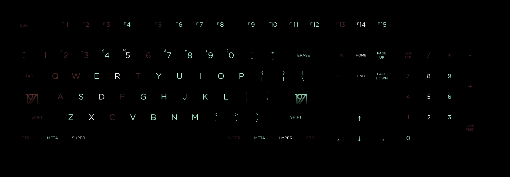

A WASD svg keyboard layout, in the spirit of 1976, by some guy from 1971.

### What actually prints...

Just to be clear, this is what is printed. You set the key colors yourself, when ordering custom keys from WASD.

# Photos

[Vist the photo album on Imgur](http://imgur.com/a/IVlZk)

# Download

[Download the SVG layout right click and save](https://raw.githubusercontent.com/jasonm23/1971-wasd/master/1971.svg)

# How to use it!?

Download _1971.svg_ from the link above.  You can then upload it into the WASD custom key caps design page at http://www.wasdkeyboards.com/

You **MUST** set the key colors manually when you order the caps.

Follow the preview image to match the key color layout. Note that all keys marked as Mint in the preview will be printed in a color close to WASD's dark purple ABS. The rest of the keys will be printed White.

If you want to match the 1976 colors more closely, you will need to edit the SVG, see below.

# I want to change some colors!

Sure thing, download [InkScape](https://inkscape.org/en/download/) and just change the colors on the layer named `design`.  It should not be necessary for me to say this, but I offer no warranty, or liability. This is an at your own risk type of deal.

There's a lot of other layers in there, any visible layer will be printed unless you specifically tell WASD not to. So I'd highly recommend you don't make any other layer visible!

If you want more detailed instructions for using InkScape, please hunt around on Google for tutorials.

# Disclaimer

I accept no responsibility or provide any warranties, guarantees or assurances with this design. I mean, it should work just fine, and it looks pretty sweet, if you ask me! But, if you're expecting some sort of shared liability etc. you just forget that right now mister (or missy)

If you get it printed by WASD and things ain't right, or you just plain hate it, sorry, them's the breaks.

I will be getting a print of this set for myself, so hold on for the preview photos if you're easily spooked by non-existent/unproven product.

Sleep tight! :)

# Credit

These designs by Scott Hansen (aka. Tycho / ISO50) inspired the poster which inspired the 1976 set... (there's a complicated, blameless, lack of credit before this. Sebastian neglected to mention where he got his 1976 poster idea from, and claimed it was purely inspired by Portal... I don't know why, but shit happens.)

Before you use this set for free, go ahead and buy one of Scott's awesome prints, or fantastic albums.

http://shop.iso50.com/collections/studio-editions/products/1971-giclee
