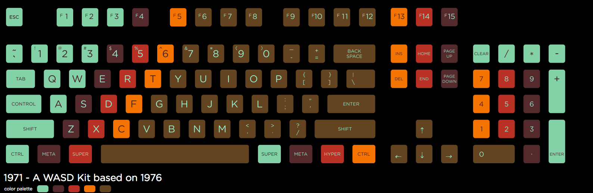

# 1971

A WASD svg keyboard layout, in the spirit of 1976, by a guy from 1971.

# How to use it!?

You can load the _1971.svg_ layout into the WASD custom key caps purchase page.

You **MUST** set the key colors manually, follow the preview image to match the layout.

DO NOT, I repeat DO NOT, supply the _1971-preview.svg_ for the printed layout.

# I want to change some colors!

Sure thing, download [InkScape](https://inkscape.org/en/download/) and just change the colors on the layer named `design`.  

There's a lot of other layers in there, any visible layer will be printed unless you specifically tell WASD not to. So I'd recommend you don't do that!

If you want more detailed instructions for using InkScape, please hunt around on Google for tutorials.

# Disclaimer

I accept no responsibility or provide no warranties, guarantees or assurances with this design. I mean, it should work just fine, and it looks pretty sweet, if you ask me!

If you get it printed by WASD and things ain't right, or you just plain hate it, sorry, them's the breaks.

I will be getting a print of this set for myself, so hold on for the preview photos if you're easily spooked by non-existent/unproven product.

Sleep tight! :)
